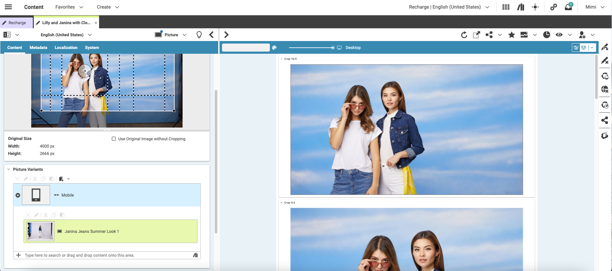
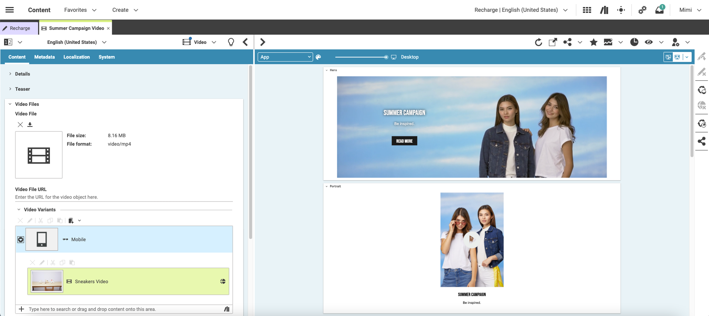
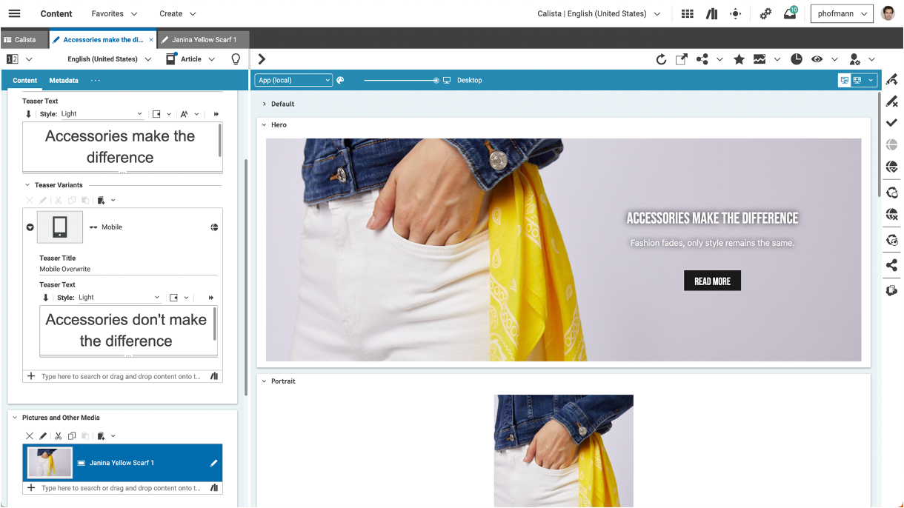

# Content Variants

This extension allows you to configure and define variants using the annotated linklist feature. Let me give you some examples:
* A dedicated mobile title overwriting the default title
* A different image for the tablet channel
* Multiple different texts for different AB Tests

### Examples

#### Defining Picture Variants



#### Defining Video Variants



#### Defining Text Variants




In this extension this is all happening within the same document.
### Documentation & Tutorial

Read the [documentation](docs/README.md) or on [GitHub Pages](https://github.com/coremedia-contributions/content-variants/docs) for more information.

### Installation

- From the project's root folder, clone this repository as a submodule of the extensions folder. Make sure to use the branch name that matches your workspace version. 
```
git submodule add https://github.com/coremedia-contributions/content-variants modules/extensions/content-variants
```

- Use the extension tool in the root folder of the project to link the modules to your workspace.
 ```
mvn -f workspace-configuration/extensions com.coremedia.maven:extensions-maven-plugin:LATEST:sync -Denable=content-variants
```
