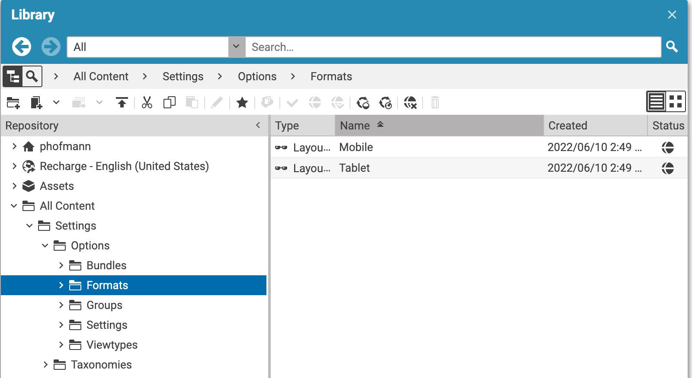
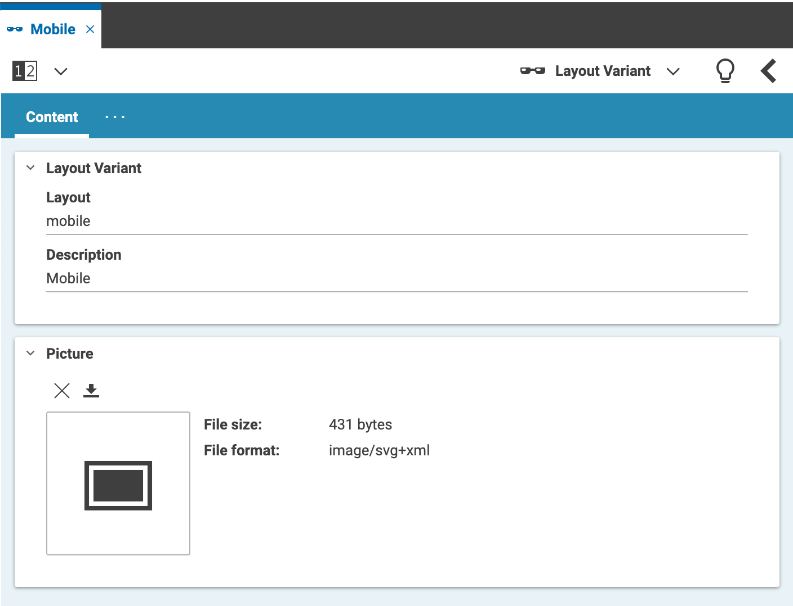
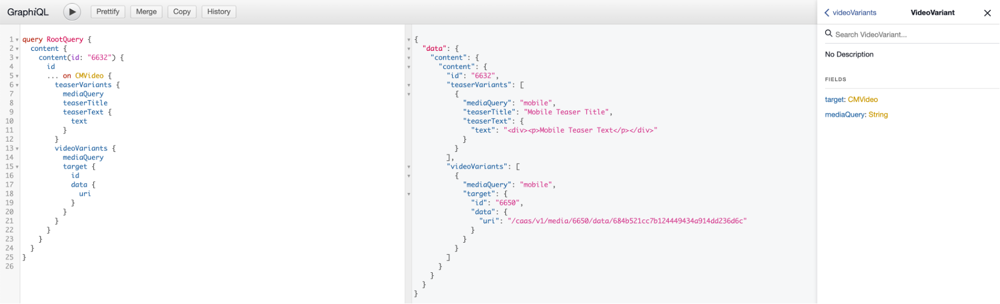
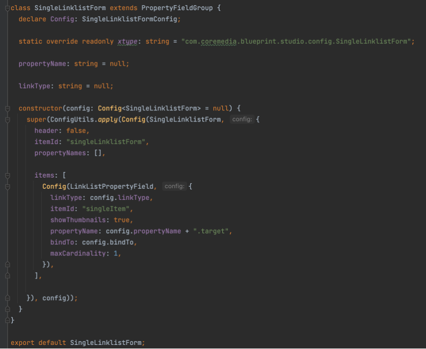

# Scope of the implementation

This extension allows business users to either
* Add inline variants (e.g., for Teaser Title and Teaser Text)
* Add alternative content items (e.g., for Pictures)

Variants are configured as Layout Variants within the Repository (/Settings/Options/Formats)

Delivery Support is currently implemented for Headless Service only

The Features uses annotated linklists. All you need to do is to define a custom from below forms similar to e.g. [SingleLinklistForm.ts](../apps/studio-client/apps/main/content-variants-studio-plugin/src/forms/SingleLinklistForm.ts)

and activate it in [ContentVariantsStudioPlugin.ts](../apps/studio-client/apps/main/content-variants-studio-plugin/src/ContentVariantsStudioPlugin.ts)

